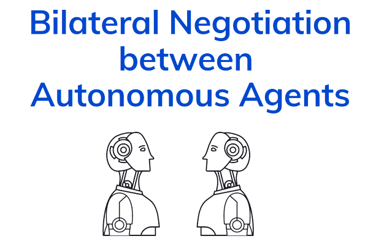

# bilateral-negotiation



Implementation of various bilateral negotiation papers  using python ```negmas``` for a IA masters thesis.

## Rosenchein and Zltokin - 1994

Implementation of the delivery men problem can be found [here](bilateral-negotiation/RosencheinyZlotkin1995.ipynb)

## Kraus - 2001

Implementation the newsletter distribution problem can be found [here](bilateral-negotiation/Kraus2201.ipynb)

## Sierra, Faratin and Jennings - 1997

Implementation of the service oriented heuristics problem can be found [here](bilateral-negotiation/Faratin1998.ipynb)


